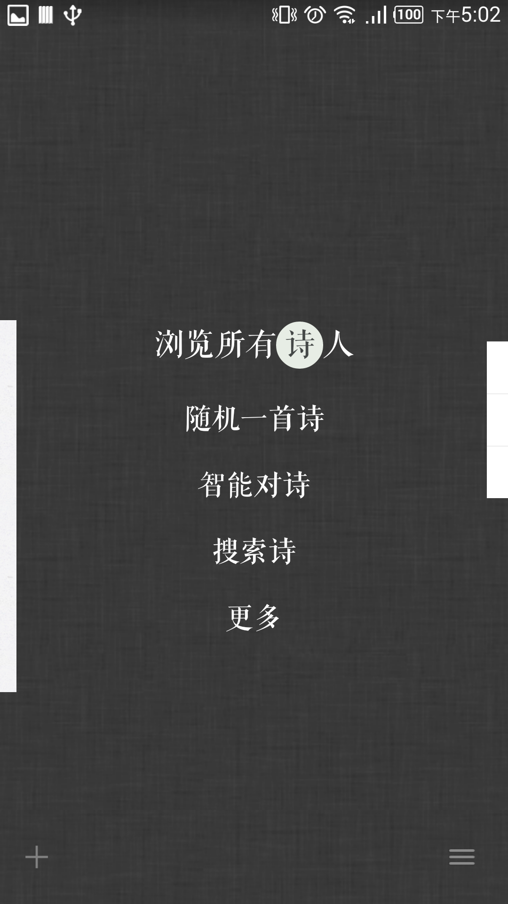
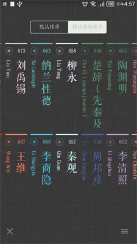
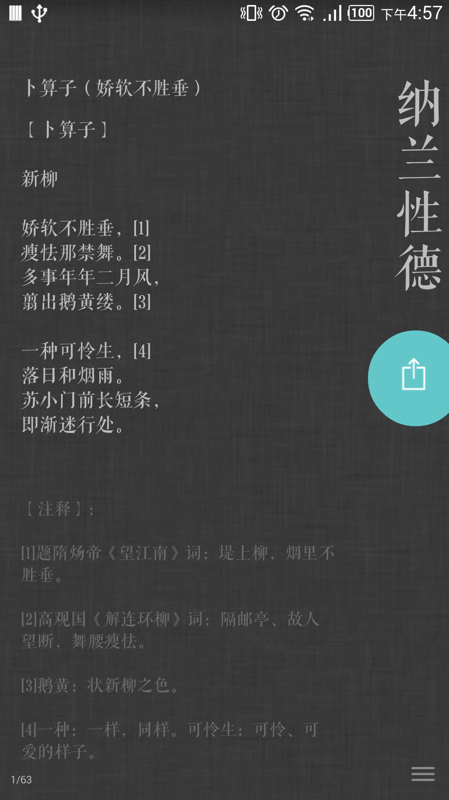
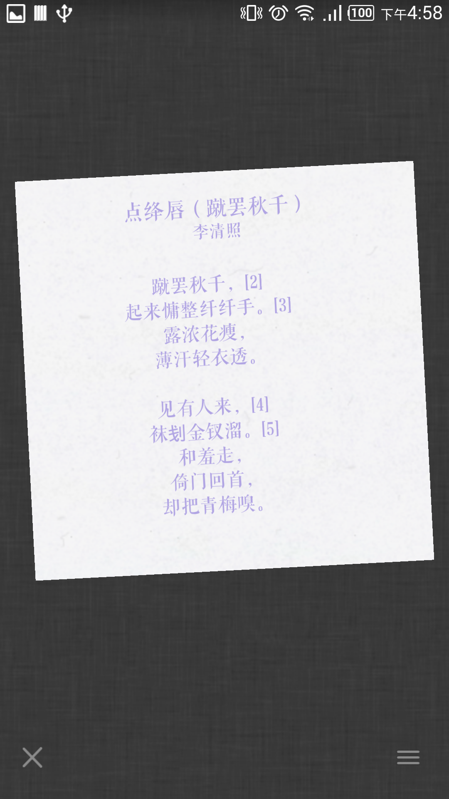
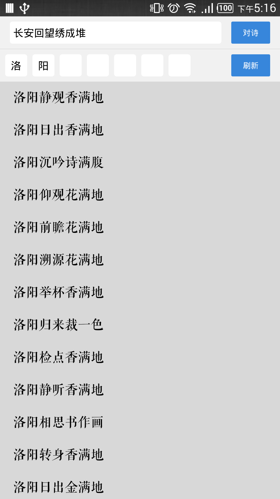

# 诗Shi 简介
  

诗Shi是一款能够自动检查平仄、辅助写诗的App。选择相应格律后，即可以开始优雅流畅的填写。在写词过程中，除了会高亮出平仄不对的汉字外，还可以方便地查找同韵字；除此之外，诗Shi还支持更换词笺纸背景，使您的习作完成后更加完美。   
1、简单易用的自然交互界面；   
2、精美优雅的词笺排版，自己的习作可以更换词笺纸背景；   
3、收录700位诗人的近5000首作品；   
4、中华新韵、平水韵、词林正韵，三种韵典任意切换；   
5、可以生成图片保存到相册，分享到各个社交应用；   
6、还有智能对诗，收藏，搜索，百科，自定义格律，自定义排版等功能等你发现 。   
# 界面展示

# 市场下载地址
<http://app.mi.com/detail/96714>

# App版权

界面风格模仿词Ci，版权为本人所有，非盈利个人应用
